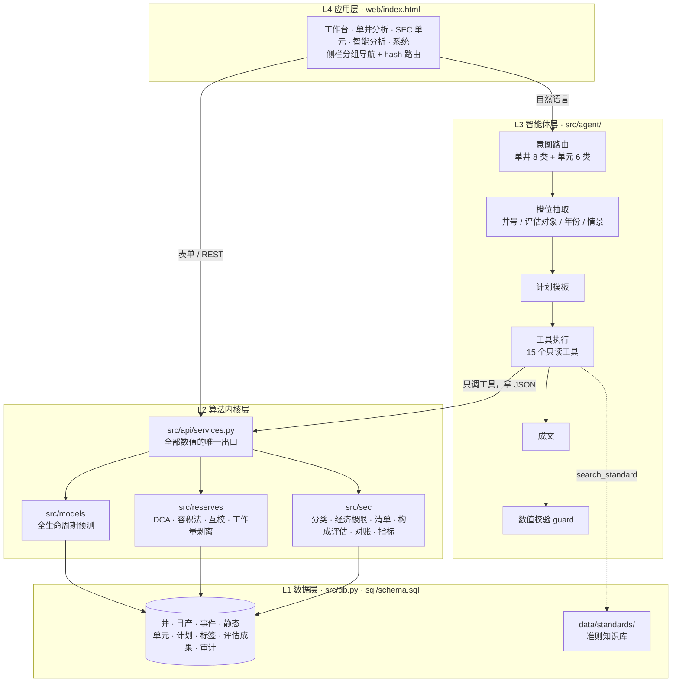
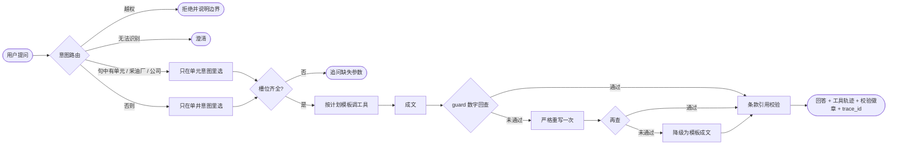
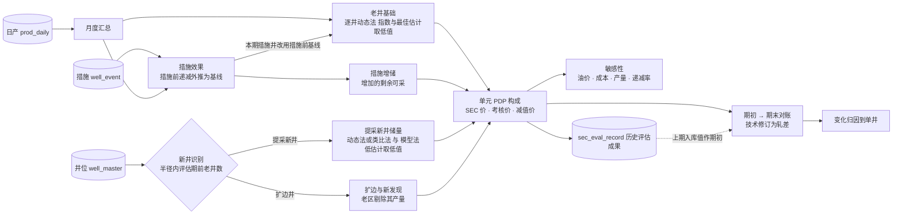

# 油井全生命周期预测与 SEC 储量智能预评估平台

大庆油田"人工智能+"青年创新比赛 · 新锐赛道 · 勘探开发研究院

两条主线，一个平台：

- **单井**：用新井早期的压力与产量数据预测见油时间、达峰时间/产量/压力与 EUR；递减分析、容积法、动静态互校、SEC 预评估。
- **SEC 单元**：按"新-老-措"把评估单元的已证实已开发储量（PDP）拆成**老井基础、措施增储、提采新井、扩边井**四部分，
  三套价格情景并行，期初到期末自动对账，变化归因落到具体的井和措施，并给出敏感性分析与运行监控。

> **本平台输出为预评估，供内部参考；最终储量认定以持证评估人签署意见为准。**
> 仓库内所有井数据均为**模拟数据**（物理模型合成，井号匿名、坐标偏移），不含任何真实井信息。

**目录**：[快速开始](#快速开始) · [运行方式详解](#运行方式详解) · [系统架构](#系统架构) · [SEC 单元构成评估](#sec-单元新-老-措构成评估) · [实测指标](#实测指标) · [设计取舍](#几个刻意的技术选择) · [已知问题](#已知问题与下一步)

---

## 快速开始

```bash
git clone https://github.com/xu5733089/oilwell-lifecycle-sec.git
cd oilwell-lifecycle-sec
pip install -r requirements.txt

python -m src.cli init        # 建库 + 生成 660 口合成井、9 个 SEC 单元、计划值、部署井位、资产账面（含真值文件）
python -m src.cli train       # 训练 + 保形校准 + 出算法指标（约 1 分钟）
python -m src.cli unit-eval   # SEC 单元两期 × 三套价格的构成评估，结果入库（约 30 秒）
python -m src.cli demo        # 端到端演示：单井预测 → 储量互校 → SEC 预评估 → 问答 → 单元构成与对账
python -m src.cli serve       # 起服务，浏览器打开 http://127.0.0.1:8000
```

**不需要任何大模型服务** —— 默认的 `mock` 后端能跑通整条智能体链路。

---

## 运行方式详解

### 1. 环境要求

| 项 | 要求 |
| --- | --- |
| Python | 3.10 及以上（已在 3.13.5 验证） |
| 操作系统 | macOS / Linux / Windows 均可，纯 Python，无编译依赖 |
| 磁盘 | 约 200 MB（数据库约 115 MB，每个模型版本约 9 MB） |
| 网络 | 仅安装依赖时需要；运行全程离线 |

依赖只有 numpy / pandas / scipy / scikit-learn / pyyaml / httpx / starlette / uvicorn / pydantic，
外加出图出报告用的 matplotlib、python-docx。用 Anaconda 的话一般只缺 `starlette`、`uvicorn`、`python-docx`。

**内网离线环境**：

```bash
pip download -d wheelhouse -r requirements.txt        # 在同架构、同 Python 版本的联网机器上打包
pip install --no-index --find-links wheelhouse -r requirements.txt
```

### 2. 分步运行

入口统一是 `python -m src.cli <子命令>`，都在仓库根目录执行。

| 步骤 | 命令 | 做什么 | 预期输出 |
| --- | --- | --- | --- |
| ① 建库 | `init [--n-wells N] [--seed S]` | 合成井写入 `data/warehouse.db`，真值写 `data/synth_*_truth.csv` | `well_master 660, prod_daily 757385, well_event 194, sec_unit 9, unit_plan_monthly 216, unit_location 218, unit_asset_book 18` |
| ② 训练 | `train [--obs-days 90] [--split time\|group\|random]` | 标签提取、GBDT 分位数、保形校准，模型写 `data/artifacts/` | 五个目标的 MAE / 覆盖率表 |
| ③ 单元评估 | `unit-eval [--as-of 2026-12-31] [--scenario all\|sec\|assessment\|impairment]` | 全部单元的"新-老-措"构成评估写入 `sec_eval_record`（历史评估成果） | 每单元 × 每情景的四项构成表 |
| ④ 演示 | `demo [--new-well 井号] [--old-well 井号]` | 四条主线依次跑 | 预测、递减、SEC 清单、问答轨迹、单元构成与对账 |
| ⑤ 服务 | `serve [--host 0.0.0.0] [--port 8000] [--no-warmup]` | HTTP 服务 + 前端；启动时后台预热最近两期单元评估（有快照时约 1 秒） | 浏览器打开 `http://127.0.0.1:8000` |

井号在编号上不连续，示例统一用 **`SB-C-0004`（新井）** 与 **`GL-A-0357`（老井）**；
单元号为 `SEC_GLA_Q1` 这类"区块 × 层系"，采油厂为"第一采油厂""第二采油厂"，公司为"示例油田公司"。

`unit-eval` 不是必需步骤：不入库时服务会按上期数据截面现算期初；入库后对账直接取入库值作期初（返回体里 `opening_source` 标明来源）。

单元评估的完整中间结果（逐井递减拟合、措施效果、新井取值）会自动存为快照（`sec_eval_snapshot`）：第一次评估公司级约 10 秒，之后服务重启直接读快照（构成 0.6 秒、对账 0.05 秒）。快照带指纹，数据、模型、口径、价格册或评估算法源码一变就自动作废重算。

### 3. 其它命令

```bash
python -m src.cli ask "GL-A-0357 的 SEC 储量预评估"               # 单井问答
python -m src.cli ask "第一采油厂 2026年 SEC 储量构成"              # 单元问答
python -m src.cli ask "SEC_GLA_Q1 2025年到2026年储量为什么变化"     # 对账 + 归因到单井
python -m src.cli ask "示例油田公司 扣3年和扣5年自然递减率" --json  # 输出完整 JSON（含轨迹与校验）
python -m src.cli report GL-A-0357 --as-of 2026-12-31             # 单井报告初稿（docx/md）
python -m src.cli unit-report --scope 示例油田公司 --format both    # SEC 单元储量预评估报告（Word + 可打印 HTML）
python -m src.cli eval-agent -n 150 --verbose                     # 智能体评测集（单井 + 单元）
python -m src.cli eval-algo                                       # 三种切分方式对比（跑完恢复原线上模型）
python -m unittest discover -s tests -v                           # 104 项测试
```

### 4. 配置

配置全部在 `conf/`，代码里不硬编码井号、区块、价格。

| 文件 | 内容 |
| --- | --- |
| `conf/config.yaml` | 数据库、合成参数（含数据截止日）、模型参数、**SEC 单元评估参数**（评估基准日、评估期、新井识别半径与邻井数、措施基线月数、扣除年限）、大模型后端 |
| `conf/label_def.yaml` | 标签口径，**带版本号**。当前 v2：EUR 为自然递减口径 |
| `conf/price_deck.yaml` | 价格册：12 个月首日价格 + **三套情景**（SEC 价 / 考核价 / 减值测试价） |
| `conf/units.yaml` | 公司 → 采油厂 → SEC 单元层级与单元成本系数（仅合成适配器读取，业务代码读表） |
| `conf/indicators.yaml` | 开发与经营指标的评分锚点与权重：内置"致密油水平井""常规注水油田"两套示例方案，界面可另存自定义方案（存库） |

**切换大模型后端**：改 `conf/config.yaml` 的 `llm.backend`，密钥只走环境变量。

| backend | 用途 | 需要的环境变量 |
| --- | --- | --- |
| `mock`（默认） | 离线开发、测试、评测、演示兜底 | 无 |
| `internal` | 内网 Qwen（OpenAI 兼容接口），需先填 `llm.internal.base_url` | `INTERNAL_LLM_API_KEY` |
| `glm` | 开发阶段对拍 | `GLM_API_KEY` |

### 5. HTTP API

前缀 `/api/v1`，GET 查询参数或 POST JSON 均可。每个响应都带 `model_version` / `label_def_version` / `data_source` / `trace_id`。

**单井**

| 路由 | 说明 |
| --- | --- |
| `/health` | 健康检查 |
| `/overview`、`/wells`、`/well/query`、`/well/curve` | 概览、井列表、单井信息与曲线 |
| `/predict/lifecycle`、`/analogs` | 全生命周期预测（P10/P50/P90 + 归因）、类比井 |
| `/reserves/dca`、`/reserves/volumetric`、`/reserves/crosscheck` | 递减、容积法、动静态互校 |
| `/sec/screen`、`/sec/reconcile`（POST） | SEC 预评估清单、手工对账 |
| `/eval/summary`、`/tools`、`/agent/ask`（POST） | 评测结果、工具 schema、自然语言问答 |

**SEC 单元**（`scope` = 单元号 / 采油厂名称 / 公司名称，必填）

| 路由 | 可选参数 | 说明 |
| --- | --- | --- |
| `/units` | — | 单元层级、可选基准日、价格情景 |
| `/unit/composition` | `as_of`、`scenario` | PDP 四项构成（按单元明细） |
| `/unit/production` | `as_of` | 逐月新-老-措产量构成 + 本期计划与实际对标 |
| `/unit/decline` | `as_of`、`exclude_years`（如 `3,5`） | 自然递减率 / 综合递减率 |
| `/unit/new-wells` | `as_of` | 提采新井 / 扩边井自动识别及储量 |
| `/unit/measures` | `as_of`、`event_type` | 措施效果，按类型汇总 |
| `/unit/reconcile` | `from_as_of`、`to_as_of`、`scenario` | 期初 → 期末对账 + 产量法折耗率 |
| `/unit/attribution` | 同上 | 变化归因到单井、措施、价格 |
| `/unit/sensitivity` | `as_of`、`scenario` | 油价、成本、产量、递减率敏感性曲线与权重 |
| `/unit/indicators` | `as_of_list` | 开发与经营指标及评分（两期对比） |
| `/unit/report` | `as_of` `scenario` `format=docx\|html` | SEC 单元储量预评估报告：Word 文件下载，或可打印（另存 PDF）的网页 |
| `/unit/categories` | `as_of`、`scenario` | 证实储量类别 PDP / PDNP / PUD，逐井、逐井位判定依据与五年规则预警 |
| `/unit/category-tracking` | `from_as_of`、`to_as_of`、`scenario` | PUD 滚动与转化率、PDNP 复产与新增停产、PDP 对账里的类别调整明细 |
| `/unit/depletion` | `as_of` | 产量法折耗额、折耗后账面价值、减值测试可收回金额与减值额（万元） |
| `/unit/indicators` 的 `profile` | 锚点方案 id | 按指定锚点方案评分，默认取默认方案 |

**配置与数据导入**（写操作：只走 HTTP 与界面、记审计日志，不注册为智能体工具）

| 路由 | 说明 |
| --- | --- |
| `GET /indicator-profiles` | 锚点方案列表与内置口径 |
| `POST /indicator-profiles/preview` · `save` · `delete` · `default` | 未保存锚点实时预览（`scope`、`spec`）、保存 / 另存、删除自定义方案、设为默认 |
| `GET /import/types` · `GET /import/template?type=` | 导入类型与字段、下载 CSV 模板（`plan` / `asset_book` / `location`） |
| `POST /import/preview` · `commit` | 上传文件（`import_type`、`filename`、`content_base64`）预检 / 确认导入 |
| `POST /import/undo` · `GET /import/history` | 撤销最近一次导入、导入记录 |

```bash
curl "http://127.0.0.1:8000/api/v1/unit/composition?scope=第一采油厂&scenario=impairment"
curl "http://127.0.0.1:8000/api/v1/unit/reconcile?scope=SEC_GLA_Q1"
curl -X POST http://127.0.0.1:8000/api/v1/agent/ask -H 'Content-Type: application/json' \
     -d '{"question":"示例油田公司 2025年到2026年储量为什么变化"}'
```

### 6. 常见问题

| 现象 | 原因与处理 |
| --- | --- |
| `ModuleNotFoundError: starlette` 等 | 依赖没装全，`pip install -r requirements.txt` |
| `井 'XXX' 不存在` / `评估对象 'XXX' 不存在` | 换一个存在的井号或单元号；错误信息里列出了可选单元 |
| `评估基准日不在可选范围内` | 只支持 `conf/config.yaml` 里的 `sec_unit.evaluation_dates`，且价格册须有对应 `as_of` |
| 单元页首次打开要等十来秒 | 公司级首次评估要逐井拟合全部老井；之后同一进程内命中缓存 |
| 递减分析 / 互校返回"峰后历史不足" | **预期行为**：未过峰的井拒绝做 DCA |
| `Address already in use` | `--port` 换一个，或 `kill $(lsof -ti:8000)` |

---

## 系统架构

### 四层，一条铁律



**铁律：大模型永远不做算术、不估数、不外推。**
写进回答的每个数字必须能在工具返回的 JSON（或工具给出的拒绝说明）里逐个找到出处，
`src/agent/guard.py` 逐个回查，对不上就重写，再对不上就降级为模板成文。
模板里需要的百分比、合计也由服务算好返回 —— 模板里乘 100 同样算智能体层做算术。

依赖只能自上而下：`src/agent → src/api/services.py → src/models, reserves, sec → src/db.py`。
内核层不知道大模型的存在，**删掉 L3，系统仍能通过表单跑完整流程**。
唯一的写操作是评估结果入库（`services.persist_unit_evaluation`），只给 CLI 用，不是工具、没有接口。

### 智能体一次问答



"递减率"对一口井是递减分析，对一个单元是老井基础递减 —— 所以路由先看评估对象是井还是单元，再选意图。

| 意图 | 计划（`?` 为可选步骤） |
| --- | --- |
| `query_well` / `predict_lifecycle` / `find_analogs` | query_well / predict_lifecycle → find_analog_wells? / find_analog_wells |
| `fit_dca` / `estimate_reserves` / `cross_check` | fit_dca / estimate_reserves_volumetric / cross_check_reserves |
| `sec_screen` | sec_screen → search_standard |
| `gen_report` | query_well → predict_lifecycle? → fit_dca? → cross_check_reserves? → sec_screen → search_standard |
| `unit_composition` | unit_sec_composition → search_standard |
| `unit_decline` | unit_base_decline |
| `measure_effect` | unit_measure_effects |
| `new_well_identify` | unit_new_wells |
| `unit_reconcile` | unit_reconcile → unit_change_attribution? → search_standard |
| `unit_sensitivity` | unit_sensitivity |

凡是合规结论（单井 SEC、单元构成、对账），计划里必带 `search_standard`，引用的条款必须真实存在于准则语料。

### 模块地图

```
conf/            config · label_def（v2）· price_deck（三套情景）· units（单元层级）· indicators（评分锚点）
sql/schema.sql   统一数据模型，SQLite 与 PostgreSQL 通用（18 张表）
src/
  cli.py         init / train / unit-eval / unit-report / demo / ask / report / eval-agent / eval-algo / serve
  pipeline.py    训练流水线        config.py 读 conf        db.py 数据库        trace.py 追溯与审计
  synth/         合成井生成器：日期对齐到数据截止日；按类型的持续措施效应；扩边井；真值
  ingest/        数据适配器：四张基础表 + 单元层级 + 单元-井归属 + 计划值 + 部署井位 + 资产账面
                 imports —— 业务数据导入（计划、资产账面、部署井位）：预检、确认、撤销
  quality/       数据质量门禁                labeling/  标签提取（EUR 自然递减口径）
  features/      早期序列 + 静态 + 完井 + 邻井特征
  models/        基线类比 · GBDT 分位数 · 保形校准 · 类比井检索 · 特征归因 · 模型注册
  reserves/      dca（含递减起点自动选取）· volumetric · spatial · crosscheck
                 workload —— 提采新井识别 · 措施效果 · 新-老-措产量构成 · 自然/综合递减率
  sec/           economics（三套价格）· classify · checklist · reconcile
                 composition —— 单元 PDP 构成 · PDNP 停产井 · PUD 部署井位 · 类型曲线 · 自动对账 · 类别滚动 · 敏感性 · 变化归因
                 finance —— 产量法折耗额 · 减值测试（可收回金额折现）
                 indicators —— 开发与经营指标计算与评分
  agent/         llm_client · router · slots · plans · tools · guard · orchestrator · rag/
  api/           services.py（全部数值的唯一产地）· app.py（Starlette HTTP 层）
  eval/          算法评测 + 智能体评测集（单井 37 个模板 + 单元 15 个模板）
  report/        docx_report —— 单井报告初稿
                 unit_report —— SEC 单元储量预评估报告（同一组内容块渲染 Word 与可打印 HTML）
data/standards/  sec_rules.md —— 准则语料，按条款切分供 RAG 引用
docs/            dev-plan-sec-unit.md —— SEC 单元扩展的开发计划
web/index.html   前端：单文件、零依赖、手写 SVG
tests/           test_kernel · test_agent · test_unit · test_report_snapshot · test_phase2，共 104 项（stdlib unittest）
```

### 数据模型

| 表 | 内容 |
| --- | --- |
| `well_master` / `geo_static` / `prod_daily` / `well_event` | 井基础与完井、静态地质、日生产、措施事件 |
| `sec_unit` / `unit_well` | 评估单元层级（公司 → 采油厂 → 单元，含成本系数）与单元-井归属 |
| `unit_plan_monthly` | 新井、措施、老井的月度产量与工作量计划 |
| `lifecycle_label` | 见油 / 达峰 / EUR 标签（带口径版本） |
| `sec_eval_record` | **历史评估成果**：每期 × 单元 × 价格情景 × 构成一行 |
| `sec_eval_snapshot` | 单元评估快照：内核完整中间结果的计算缓存，按指纹自动失效，可随时清空 |
| `unit_location` | 开发方案部署井位：坐标、计划钻井年月、首次入账日期、是否已钻（PUD 与五年规则） |
| `unit_asset_book` | 单元资产账面价值：各期期初净值（可空，逐期滚动）与本期资本化投入（折耗与减值） |
| `indicator_profile` | 指标评分锚点方案（内置 + 自定义，默认方案） |
| `import_batch` | 数据导入批次：写入的主键与被替换的旧行，用于撤销 |
| `reserves_record` / `model_run` / `prediction` / `audit_log` | 储量结果、训练记录、预测留痕、审计日志 |

### 前端

`serve` 后打开 `http://127.0.0.1:8000`。布局按企业业务系统组织：深色侧栏分组导航，
顶栏是面包屑与数据源标识，页头右侧放本页的全局筛选（井号 / 评估对象 · 基准日 · 价格情景），
工作区由指标条、面板和紧凑表格组成。页面地址形如 `#/unit`，可直接收藏或分享。

| 分组 · 页面 | 看什么 |
| --- | --- |
| 工作台 · 总览 | 指标条（井数、累产、标签、质量门禁、切分）；井位图；模型回测与质量门禁表；可搜索、分页的井列表（点行进入单井） |
| 单井分析 · 全生命周期预测 | 井头信息；五个目标的 P50 与区间（老井附实际值）；产量剖面与概率带；特征归因；类比井 |
| 单井分析 · 储量与 SEC 预评估 | EUR / 剩余可采 / SEC 类别 / 已证实储量；递减参数；动静态互校；容积法分布；SEC 满足性检查清单 |
| **SEC 单元 · 构成评估**（技术人员） | PDP 与四项构成指标条；子页签：储量构成（按单元堆叠条、逐月新-老-措产量、构成口径表）· 对账与归因（瀑布图 + 变化归因）· 新井识别（按提采/扩边筛选）· 措施与递减 · 敏感性 |
| **SEC 单元 · 类别跟踪** | 证实储量合计与 PDP / PDNP / PUD 指标条、PUD 转化率与五年规则；各单元类别堆叠条；PUD 滚动瀑布图；部署井位与停产井分布图；停产井清单；部署井位清单（按判定筛选） |
| **SEC 单元 · 折耗与减值** | 期初净值、投入、折耗额、可收回金额、减值额、期末净值；资产净值变动瀑布图；各单元账面余量；单元明细 |
| **SEC 单元 · 运行监控**（管理层） | PDP / 产量 / 新井 / 措施 / 两组综合分指标条；按所选锚点方案的指标两期对比（哑铃图）与明细表；计划与实际偏差；各单元储量构成两期对比 |
| 智能分析 · 智能问答 | 常用问题列表；分析结果（数值一致性、意图、耗时标签）与输入框；工具调用轨迹 |
| 系统 · 数据导入 | 选择类型 → 上传 CSV / Excel → 逐行逐列预检（错误、提醒、数据预览）→ 确认导入；字段说明与模板下载；导入记录与撤销 |
| 系统 · 指标口径 | 锚点方案列表；锚点与权重编辑，实时预览得分与相对已保存方案的变化；另存、保存、设为默认、删除 |
| 系统 · 模型评测 | 智能体指标与达标状态、分类别表现、三种切分对比 |

**零依赖单文件**：不引框架、不连 CDN，图表全部手写 SVG。
四个构成的身份色全站固定（老井基础 / 措施 / 提采新井 / 扩边井），证实储量类别（PDP / PDNP / PUD）另用一组颜色，不与构成混用，
经 dataviz 校验脚本验证浅色（#FFFFFF）、深色（#141B26）两种表面全项通过（四色相邻色盲 ΔE ≥ 10）。
每张图都有悬停提示和"图表 / 表格"切换，不画双轴图；口径说明收在面板右上角的"口径"按钮里。
窄屏（≤ 900px）下侧栏变为顶部横向导航，表格在面板内横向滚动。

**井位图**：东西、南北同一比例尺的等比例投影，按区块画出范围与井数；可在"区块 / 累产 / 投产年份"三种着色间切换（后两者为单一色相顺序色）；拖动平移、双击放大、⌘/Ctrl + 滚轮或触控板双指缩放，点区块图例会聚焦并飞到该区块；当前井带脉冲标记，悬停井列表的行会在图上标出对应的井。

**动效**：内容就位时面板依次浮现、指标数值滚动到目标值；柱状图从基线长出、瀑布图逐级落下、折线与区间带从左向右展开；子页签下划线滑动、加载时显示骨架屏。只动 transform / opacity，只在首次绘制时播放，系统开启"减少动态效果"时全部关闭。

**报告导出**：构成评估页右上角"导出 Word"按当前评估对象、基准日、价格情景生成报告（摘要、构成、价格情景对比、产量与递减、新井、措施、对账与归因、证实储量类别、折耗与减值、敏感性、指标评价、口径与局限、新井清单附录、数据追溯附录）；"打印版 / PDF"打开同内容的网页，浏览器打印时另存为 PDF。接口为 `GET /api/v1/unit/report?scope=&as_of=&scenario=&format=docx|html`。

---

## SEC 单元"新-老-措"构成评估

储量评估正在从年度走向半年、月度常态化。核心做法是把一个评估单元的 PDP 拆成来源可追溯的几部分，再与上期闭合对账。



| 构成 | 口径 | 实现 |
| --- | --- | --- |
| **提采新井** | 评估期内投产、打在已探明范围内的井 | 半径 1500 m 内评估期前已投产老井 ≥ 3 口即判提采；储量取"动态法（历史够长）或类比法（同单元老井类型曲线）"与"模型法低估计（全生命周期模型的 P10 − 累产）"两者之低值 |
| **扩边井** | 评估期内投产、周边没有老井 | 单列为扩边与新发现，老区 PDP 不含其产量；储量同上 |
| **措施增储** | 本期实施的补孔、压裂、酸化、大修、防砂、注水受益 | 措施前最多 24 个月用修正双曲外推为基线；已实现增油 = 实际 − 基线；增加的剩余可采 = 有措施截经济极限 − 无措施截经济极限；观察期不足 3 个月的不计增储 |
| **老井基础** | 其余老井 | 逐井峰后递减拟合（分段回归自动跳过措施台阶；中途长停的月份从递减时间里扣除；开井不足半月的月份不参与拟合；拟合不出递减的井改用类比法），指数递减与最佳估计取低值且不缓于终端递减，截单井经济极限；本期做过措施的井用措施前基线；近 3 个月无产量的井转入 PDNP 单独取值；峰后历史不足的井用类比法 |

配套：

- **三套价格**：SEC 价（12 个月首日均价）、考核价、减值测试价，经济极限各算一次；单元再乘自身成本系数。
- **对账**：期初 → 产量消耗 → 价格/成本修订（用期末数据 + 期初价格重算）→ 提采新井 → 措施 → 扩边 → 类别调整（停产井复产转入 − 在产井停井转出）→ 技术修订（轧差）→ 期末；附产量法折耗率。
- **递减率**：扣近 N 年新井与措施增油后的自然递减率、只扣新井的综合递减率，年递减 = 1 − (1 − 月递减)^12。
- **敏感性**：油价、成本、老井产量、递减率四个参数，每个一张小图；典型扰动下的 PDP 摆幅占比即敏感权重，逐单元给出。
- **变化归因**：对账行项按影响排序，每项落到具体证据 —— 贡献最大的新井、增储最多的措施、价格与经济极限的变化、日产降幅最大的老井及其含水变化。
- **指标评价**：自然/综合递减率、含水与含水上升、开井率、措施有效率、储采比、产量与新井计划完成率、吨油成本 / 净收入 / 利润，按锚点打分。

业内平台自述仍靠人工的环节，这里都给了自动化实现：**提采新井判定**（邻井规则 + 合成真值测准确率）、
**历史评估成果管理**（`sec_eval_record` 入库、对账取上期值）、**PDNP / PUD 动态跟踪**、**折耗额与减值测试**。

### 证实储量类别、折耗与减值

| 项 | 规则 |
| --- | --- |
| **PDNP（停产井）** | 近 3 个月无产量的老井；停产不超过 24 个月；用停产前数据逐井递减拟合，从停产时点续算到经济极限（停井期间地层不采出）；剩余可采的净收入须覆盖复产作业费。长停、不经济、资料不足的井如实列出、不计入 |
| **PUD（部署井位）** | 按顺序判定：已钻 → 已取消 → 尚未入账 → **五年规则**（首次入账五年内未钻即移出；计划钻井晚于期限的不入账）→ **连续性**（半径 1000 m 内当期在产井 ≥ 3 口）→ **经济性**（单元类型曲线 × 0.85 截到经济极限，累计净现金流须覆盖钻完井投资）。每个井位给出判定、期限、剩余年限 |
| **类别滚动** | PUD：期初 → 钻井转为已开发 → 五年规则移出 → 其他移出 → 修订 → 新入账 → 期末，附转化率与"按目前节奏消化期末 PUD 所需年数"；PDNP：期初 → 复产转 PDP → 移出 → 修订 → 新增停产 → 期末。两张表按构造闭合 |
| **折耗** | 产量法折耗率 = 本期产量 /（期末 PDP + PDNP + 本期产量），储量取 SEC 价；折耗额 =（期初资产净值 + 本期资本化投入）× 折耗率；期初净值缺失时取上期期末净值滚动 |
| **减值** | 可收回金额 = 减值测试价下证实已开发储量的未来净现金流折现值（单元指数递减剖面，初始月产取近 3 个月月均；吨油净现金流 = 吨油净收入 − 吨油操作成本；折现率 10%）；减值额 = max(0，折耗后账面价值 − 可收回金额)，逐单元测试后相加 |

资产账面、部署井位、计划值在合成轨道由适配器生成，真实数据通过 **系统 · 数据导入** 上传财务台账、开发方案与计划表即可替换，无需改代码。

---

## 实测指标

660 口合成井（600 口基础井 + 60 口上一评估年投产井），数据截至 2026-12-31。以下数字均可用上面的命令复现。

### 算法层（`train`，时间外推切分）

| 目标 | 模型 MAE | 基线 MAE | 相对基线提升 | 区间覆盖率 | 校准前 |
| --- | ---: | ---: | ---: | ---: | ---: |
| 见油时间 (d) | 0.75 | 5.79 | **+87.0%** | 0.75 | 0.56 |
| 达峰时间 (d) | 29.6 | 46.9 | **+36.9%** | 0.82 | 0.54 |
| 达峰产量 (t/d) | 1.14 | 4.65 | **+75.6%** | 0.85 | 0.61 |
| 达峰压力 (MPa) | 0.51 | 2.24 | **+77.2%** | 0.89 | 0.56 |
| EUR (t，自然递减口径) | 1367 | 3603 | **+62.1%** | 0.68 | 0.33 |

训练 / 校准 / 测试 = 253 / 91 / 114 口；数据质量门禁通过 632 / 660 口。
基线 = 邻井类比 + Arps 外推。`eval-algo` 显示随机切分在 5 个目标上平均乐观 26.3%，对外一律用时间切分。

### SEC 单元内核（合成真值上的验收，`tests/test_unit.py`）

| 项 | 结果 | 验收线 |
| --- | ---: | ---: |
| 提采新井 / 扩边井识别准确率（两期 136 口新井） | 1.00 | ≥ 0.90 |
| 措施已实现增油相对误差（130 次措施） | 中位 5.9%，P75 45% | 中位 ≤ 25% |
| 递减起点选取（构造序列：上升转递减、措施台阶） | 误差 ≤ 3 个月 | ≤ 3 个月 |
| 对账闭合 / 敏感性方向 | 闭合；油价↑不降、成本↑与递减↑不升 | 全部满足 |

识别准确率 1.00 要打折看：合成的扩边井离老井覆盖范围至少 1500 m，边界是干净的，真实区块边界要模糊得多。

### 公司级示例（2026-12-31，SEC 价）

| 构成 | PDP (t) | 占比 |
| --- | ---: | ---: |
| 构成 | PDP (t) | 占比 |
| --- | ---: | ---: |
| 老井基础（442 口） | 551,837 | 60.7% |
| 措施增储（69 次，有效 65 次） | 48,829 | 5.4% |
| 提采新井（120 口） | 225,543 | 24.8% |
| 扩边井（41 口） | 82,471 | 9.1% |
| **合计** | **908,679** | |

考核价 864,707 t，减值测试价 804,981 t。对账 2025 → 2026（期初取入库记录）：期初 942,348，产量 −493,389，价格/成本 −45,738，
提采新井 +307,661，措施 +67,348，扩边 +107,499，类别调整 −75,218（复产转入 5 口 +5,008，停井转出 37 口 −80,226），
技术修订 +98,167，期末 908,679，闭合；产量法折耗率 32.89%。
老井基础的最佳估计为 920,286 t，保守取值约为其六成；扣近 3 年 / 5 年的自然递减率 35.6% / 29.4%。
敏感权重：老井产量 43.3%、油价 20.5%、成本 19.2%、递减率 16.9%。

**证实储量类别**：合计 1,190,554 t = PDP 908,679（76.3%）+ PDNP 97,834（8.2%，32 口停产井）+ PUD 184,041（15.5%，28 个井位）。
PUD 滚动：期初 80 个井位 535,504 t，钻井转化 46 个（转化率 57.5%），五年规则移出 6 个，其他移出 7 个，新入账 7 个，期末 28 个。
部署井位判定：已入账 28、已钻 119、超五年 9、计划晚于五年 9、连续性不足 14、不经济 39。

**折耗与减值**（万元）：期初净值 41,730，本期投入 67,355，折耗额 36,545（折耗率 32.89%），折耗后账面 72,540，
可收回金额 100,298；4 个单元减值合计 10,720（SEC_GLB_F1、SEC_SBC_F1、SEC_SBC_Q1、SEC_SBC_Q2），期末净值 61,820。

### 智能体层（`eval-agent -n 150`，`mock` 后端）

评测集由单井 37 个、单元 20 个模板铺开生成，六类构成（正常 / 口语 / 组合 / 缺数据 / 越权 / 诱导）。

| 指标 | 实测 | 目标 | 达标 |
| --- | ---: | ---: | :---: |
| 意图识别准确率 | 1.00 | ≥0.95 | ✅ |
| 槽位抽取 F1 | 0.92 | ≥0.90 | ✅ |
| 工具链正确率 | 0.95 | ≥0.90 | ✅ |
| **数值一致性通过率** | **1.00** | =1.00 | ✅ |
| 条款引用命中率 | 1.00 | ≥0.90 | ✅ |
| 无据结论率（幻觉率） | 0.00 | ≤0.01 | ✅ |
| P95 响应时间 | 3449 ms | ≤30000 | ✅ |
| 人工干预率 | 0.09 | ≤0.15 | ✅ |

两处口径修正（不是改评测集期望值）：
① 工具链正确率衡量"调没调对工具"，内核按业务规则拒绝（井不存在、峰后历史不足）算调对，参数错误 / 内部异常 / 越界仍算错；
② 内核拒绝说明里的数字出自工具，纳入 guard 回查依据。

**这张表要看清楚它的边界**：用例是我们自己按模板铺开出的题，不是硬基准；真正有价值的评测集要由业务方出题。

---

## 几个刻意的技术选择

**为什么主力是 GBDT 而不是 LSTM。** 几百口井量级、"短序列统计量 + 异构表格"特征，树模型更稳、训练秒级、天然可归因。

**为什么不用自由 ReAct。** 内网 27B 量级模型多轮自由调用容易漏参、跑飞。固定计划模板，大模型只填参数不改流程。

**为什么 P90 能对应 SEC 的"合理确定性"。** 分位数模型经归一化保形校准后的低估计对应"≥90% 把握"口径 —— 前提是区间确实校准过，所以覆盖率是这条叙事的关键，也是 SEC 清单里"合理确定性"一项的判据。

**分位数口径全仓库统一。** `p10` 就是 10% 分位（数值小者）；储量行业的"P90 低估计"用 `low_estimate` 表达。

**为什么 EUR = 累产 + 剩余可采。** 已采出的量没有不确定性，不该进概率区间；整条积分还会出现"EUR 小于累产"。
全生命周期预测对老井同样加物理下界：EUR 低估计不低于已累产。

**为什么 EUR 标签改为自然递减口径（v2）。** 合成数据的措施改为持续增油后，v1 标签混进了几年后才做的压裂、补孔增油，
早期 90 天数据不可能预测，EUR 预测 MAE 放大一个数量级。措施增油交给单元构成评估单列，两边口径不再重叠。

**为什么老井基础逐井算，不做单元整体递减拟合。** 单元产量是不同投产批次叠加出来的，近几年还在投产时整体曲线不是 Arps 形态，
短尾巴外推在相邻两期之间大起大落（试算中同一单元一年内相差 2.5 倍），技术修订随之失真。单元整体曲线只用来算递减率。

**为什么新井取两法低值。** 类比法和动态法随经济极限变化、能做价格敏感性，但没有不确定性；模型法低估计校准过但不随价格变。
取低值同时满足"合理确定性"和"价格情景可比"。

**措施增储不随经济极限单调。** 经济极限抬高时，没有措施的基线更早关井，措施延寿的占比反而更大 —— 这是"有无对比"口径的必然结果，测试里专门不测单调性。

**为什么对账里技术修订是轧差。** 与 20-F 的 revisions of previous estimates 一致：价格、新井、措施、扩边各自独立算出，剩下的是递减规律变化与停井；
上期结果入库后取入库值作期初，差额同样进技术修订。

**递减分析必须已过峰；b > 1 必须设终端递减率；新井与措施基线的动态法一律带终端递减。**
不设终端递减的双曲在 b→1 时近似调和递减，50 年评估期内一直高于经济极限，短历史井的剩余可采会被放大数倍。

**为什么两期指标用哑铃图、敏感性用四张小图。** 雷达图的面积随轴顺序变化，读不准差值；四个参数横轴单位各不相同，合进一张图就成了多轴图。

---

## 数据：三条轨道，一套 schema

| 轨道 | 适配器 | 状态 |
| --- | --- | --- |
| 合成井（物理模型生成，自带真值） | `src/ingest/synth_adapter.py` | 已实现 |
| 公开数据集（Volve、NDIC 等） | `src/ingest/volve_adapter.py` | 待写 |
| 院内真实数据（脱敏） | `src/ingest/dqmds_adapter.py` | 待写 |

真实数据到位那天的工作量是"写一个适配器 + 重跑训练"：
适配器负责四张基础表，外加 `sec_unit` / `unit_well`（储量单元台账）与 `unit_plan_monthly`（计划系统）。

合成数据的设计要点：在产井的记录统一截到数据截止日（只平移日期，产量序列与随机数流不变，已逐井验证）；
措施按类型给出持续增油（独立随机数流）；追加上一评估年投产批次；部分新井放到老井覆盖范围之外作扩边井。
真值（`synth_truth.csv`、`synth_event_truth.csv`）只供测试与评测，业务代码不读。

**合规**：全流程内网运行；井号匿名、坐标偏移；所有响应带 `trace_id`，工具调用全程写 `audit_log`；
数据库、模型产物、真值文件均本地生成，**不进版本库**。

---

## 已知问题与下一步

- **EUR 区间覆盖率 0.68**（名义 0.80）。标签改为自然递减口径后，时间外推切分下校准集与测试集分布漂移更明显；
  单井 SEC 清单的"合理确定性"一项因此如实判为"需人工确认"。下一步试按目标分组的 Mondrian 保形。
- **新井识别在合成数据上过于容易**（准确率 1.00），真实区块边界模糊，识别半径与邻井阈值需用业务标注重新标定。
- **措施增油误差长尾**：中位 5.9%，但 P75 达 45%，集中在快速衰减的酸化与观察期短的措施。
- **老井已证实口径是确定性的保守取值**（指数递减与最佳估计取低值，公司级约为最佳估计的六成），不是校准过的概率区间。
- **PUD 判定是规则化的简化**：连续性只看半径内在产井数，没有储层连续性的地质证据；单井取值用单元类型曲线折减，未区分井型与部署密度；首次入账日期以井位表为准。
- **PDNP 复产只看复产作业费**：未考虑待接管线、地面设施等停产原因；停产超过 24 个月一律按长停不计。
- **减值测试是简化口径**：单元级指数递减剖面，不含 PUD 未来投资与弃置费，折现率与汇率为配置值；合成资产账面按单井投资与井龄估算，仅供演示。
- **指标锚点是示例值**（两套内置方案），正式使用须由开发与经营部门按本油田水平标定并另存。
- **数据导入**只支持 CSV 与 .xlsx（不支持旧版 .xls），单文件 5 MB；只能撤销每种类型最近一次导入。
- 注水受益没有注采对应关系，受益时点来自事件记录。
- **单井 DCA 对措施后的井**可能长期高于经济极限（t_econ 触及 50 年上限），清单中已明确标注"该时刻为积分上限"。
- **单元评估快照整体失效后需重算**：数据、模型、口径、价格册或评估算法任一变化，首次打开公司级页面仍需约 10 秒（算完写回快照）；`unit-eval` 入库的成果目前只用于对账期初。
- **PDF 由浏览器打印生成**：服务端不依赖 LibreOffice；报告图件需要中文字体，缺字体时报告会注明图件未生成。
- **工具链正确率 0.95 的缺口**：合规计划在主工具失败后不再检索条款，缺数据类用例因此记为未调全。
- **单元级模板只在 `mock` 后端评测过**；接入真实大模型后自由成文仍受 guard 约束，但需要补一轮评测。
- **评测页尚未展示失败样例明细**。序列模型、物理正则、SHAP 归因、准则正式条文仍为下一步。

---

## 参与开发

改动前先读 [AGENTS.md](AGENTS.md)：铁律、分层依赖方向、口径约定、新增能力的七步顺序、不许删的测试、配色约定。
单元扩展的背景与取舍见 [docs/dev-plan-sec-unit.md](docs/dev-plan-sec-unit.md)。
提交前确保 `python -m unittest discover -s tests` 全绿，且 `backend: mock` 能跑通。
