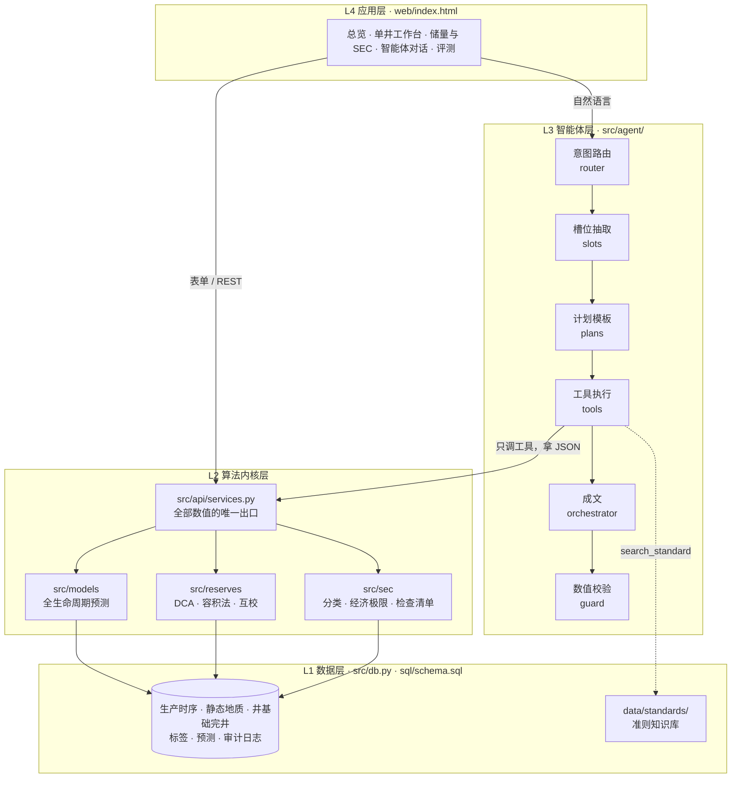
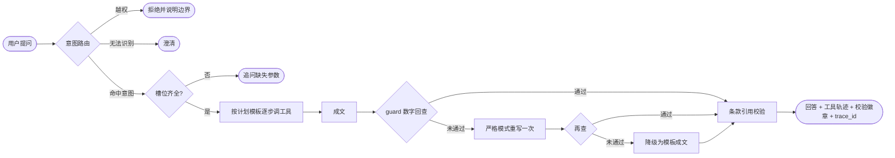

# 油井全生命周期预测与 SEC 储量智能预评估平台

大庆油田"人工智能+"青年创新比赛 · 新锐赛道 · 勘探开发研究院

用新井早期的压力与产量数据预测其见油时间、达峰时间/产量/压力与 EUR；
把静态地质参数与动态生产数据打通做储量拟合；
再把两条路线的结果与 SEC 准则对照，产出可追溯的储量预评估结论。

> **本平台输出为预评估，供内部参考；最终储量认定以持证评估人签署意见为准。**
> 仓库内所有井数据均为**模拟数据**（物理模型合成，井号匿名、坐标偏移），不含任何真实井信息。

**目录**：[快速开始](#快速开始) · [运行方式详解](#运行方式详解) · [系统架构](#系统架构) · [实测指标](#实测指标) · [设计取舍](#几个刻意的技术选择) · [已知问题](#已知问题与下一步)

---

## 快速开始

```bash
git clone https://github.com/xu5733089/oilwell-lifecycle-sec.git
cd oilwell-lifecycle-sec
pip install -r requirements.txt

python -m src.cli init      # 建库 + 生成 600 口合成井（含真值标签）
python -m src.cli train     # 训练 + 保形校准 + 出算法指标
python -m src.cli demo      # 端到端演示：新井预测 → 储量互校 → SEC 预评估 → 自然语言问答
python -m src.cli serve     # 起服务，浏览器打开 http://127.0.0.1:8000
```

四条命令跑完即得到完整可用的平台。**不需要任何大模型服务** —— 默认的 `mock` 后端能跑通整条智能体链路。

---

## 运行方式详解

### 1. 环境要求

| 项 | 要求 |
| --- | --- |
| Python | 3.10 及以上（已在 3.13.5 验证） |
| 操作系统 | macOS / Linux / Windows 均可，纯 Python，无编译依赖 |
| 磁盘 | 约 150 MB（数据库约 112 MB，模型产物约 9 MB） |
| 网络 | 仅安装依赖时需要；运行全程离线 |

依赖只有 numpy / pandas / scipy / scikit-learn / pyyaml / httpx / starlette / uvicorn / pydantic，
外加两个出图出报告用的 matplotlib、python-docx。

> 用 Anaconda 的话，科学计算包通常已自带，一般只缺 `starlette`、`uvicorn`、`python-docx` 三个。

**内网离线环境**按下面打包即可：

```bash
pip download -d wheelhouse -r requirements.txt        # 在同架构、同 Python 版本的联网机器上打包
pip install --no-index --find-links wheelhouse -r requirements.txt
```

### 2. 分步运行

所有命令都在仓库根目录执行，入口统一是 `python -m src.cli <子命令>`。

**① 建库并生成数据** —— `init`

```bash
python -m src.cli init                      # 默认 600 口井，种子 20260908
python -m src.cli init --n-wells 300 --seed 1
```

写入 `data/warehouse.db`（SQLite），并把合成真值写到 `data/synth_truth.csv`。预期输出：

```
已入库： {'well_master': 600, 'geo_static': 600, 'prod_daily': 725021, 'well_event': 120}
```

种子固定时井号是确定的；井号在编号上不连续（如 `GL-A-0005`、`GL-A-0008`），下文示例统一用
**`SB-C-0004`（新井）** 和 **`GL-A-0357`（老井）**，这两口在默认种子下一定存在。

**② 训练模型** —— `train`

```bash
python -m src.cli train                     # 默认观测窗 90 天、时间外推切分
python -m src.cli train --obs-days 60 --split group
```

`--split` 可选 `time` / `group` / `random`；正式评测只用 `time` 或 `group`，
`random` 只用于证明随机切分会高估效果（见 `eval-algo`）。
模型产物写到 `data/artifacts/`，`LATEST` 文件指向当前版本。

**③ 端到端演示** —— `demo`

```bash
python -m src.cli demo
python -m src.cli demo --new-well SB-C-0004 --old-well GL-A-0357
```

依次跑三条主线：新井全生命周期预测（含区间、归因、类比井）→ 老井递减分析、储量互校与 SEC 预评估 →
自然语言提问（打印工具调用轨迹与数值校验结果）。

**④ 启动服务** —— `serve`

```bash
python -m src.cli serve                     # http://127.0.0.1:8000
python -m src.cli serve --host 0.0.0.0 --port 8080
```

停止：前台运行时按 `Ctrl+C`；后台运行时 `kill $(lsof -ti:8000)`。

### 3. 其它命令

```bash
python -m src.cli ask "GL-A-0357 的 SEC 储量预评估"          # 自然语言提问
python -m src.cli ask "SB-C-0004 什么时候达峰" --json         # 输出完整 JSON（含轨迹与校验）
python -m src.cli report GL-A-0357 --as-of 2026-12-31        # 生成单井报告初稿（docx/md）
python -m src.cli eval-agent -n 150 --verbose                # 跑智能体评测集
python -m src.cli eval-algo                                  # 三种切分方式对比
python -m unittest discover -s tests -v                      # 48 项测试
```

### 4. 配置

配置全部在 `conf/`，代码里不硬编码井号、区块、价格。

| 文件 | 内容 |
| --- | --- |
| `conf/config.yaml` | 数据库地址、合成参数、模型参数（观测窗、分位数、保形 α、切分方式）、大模型后端 |
| `conf/label_def.yaml` | 见油 / 达峰 / EUR 的标签口径，**带版本号**，改口径必须升版本 |
| `conf/price_deck.yaml` | SEC 价格册（12 个月首日价格） |

**切换大模型后端**：改 `conf/config.yaml` 的 `llm.backend`，密钥只走环境变量。

| backend | 用途 | 需要的环境变量 |
| --- | --- | --- |
| `mock`（默认） | 离线开发、测试、评测、演示兜底 | 无 |
| `internal` | 内网 Qwen（OpenAI 兼容接口），需先填 `llm.internal.base_url` | `INTERNAL_LLM_API_KEY` |
| `glm` | 开发阶段对拍 | `GLM_API_KEY` |

**换 PostgreSQL**：改 `db.url`，DDL 用 `sql/schema.sql`，两边通用。

### 5. HTTP API

服务启动后，所有数值能力都以 REST 形式暴露，前缀 `/api/v1`。单井类接口接受 GET 查询参数或 POST JSON。

| 路由 | 方法 | 说明 |
| --- | --- | --- |
| `/health` | GET | 健康检查，返回模型版本、口径版本、数据源 |
| `/api/v1/overview` | GET/POST | 全局概览：井数、累产、质量门禁 |
| `/api/v1/wells` | GET/POST | 井列表 |
| `/api/v1/well/query` | GET/POST | 单井基础信息与生产现状 |
| `/api/v1/well/curve` | GET/POST | 单井生产曲线（按月聚合） |
| `/api/v1/predict/lifecycle` | GET/POST | 全生命周期预测（P10/P50/P90 + 归因） |
| `/api/v1/analogs` | GET/POST | 类比井检索 |
| `/api/v1/reserves/dca` | GET/POST | 递减分析（Arps / 修正双曲 / Duong） |
| `/api/v1/reserves/volumetric` | GET/POST | 容积法蒙特卡洛 |
| `/api/v1/reserves/crosscheck` | GET/POST | 动静态储量互校 |
| `/api/v1/sec/screen` | GET/POST | SEC 预评估：分类 + 已证实储量 + 满足性检查清单 |
| `/api/v1/sec/reconcile` | POST | 储量对账 |
| `/api/v1/eval/summary` | GET/POST | 评测结果汇总 |
| `/api/v1/tools` | GET | 智能体工具的 function schema |
| `/api/v1/agent/ask` | POST | 自然语言问答 |

```bash
curl "http://127.0.0.1:8000/api/v1/sec/screen?well_code=GL-A-0357"

curl -X POST http://127.0.0.1:8000/api/v1/agent/ask \
     -H 'Content-Type: application/json' \
     -d '{"question":"GL-A-0357 的 SEC 储量预评估"}'
```

每个响应都带四个追溯字段：`model_version` / `label_def_version` / `data_source` / `trace_id`。

### 6. 常见问题

| 现象 | 原因与处理 |
| --- | --- |
| `ModuleNotFoundError: starlette` / `uvicorn` / `docx` | 依赖没装全，`pip install -r requirements.txt` |
| `井 'XXX' 不存在于井表中` | 井号不连续，换一个存在的井号；可从 `/api/v1/wells` 取列表 |
| 服务起来但页面没有数据 | 还没跑 `init` 和 `train` |
| 递减分析 / 储量互校返回"峰后历史不足" | **预期行为**：未过峰或峰后不足 180 天的井拒绝做 DCA，见[设计取舍](#几个刻意的技术选择) |
| `Address already in use` | 8000 端口被占，`--port` 换一个，或 `kill $(lsof -ti:8000)` |

---

## 系统架构

### 四层，一条铁律



**铁律：大模型永远不做算术、不估数、不外推。**

它能看到的数字只有工具返回的 JSON；写进回答的数字必须能在那份 JSON 里逐个找到出处。
成文之后 `src/agent/guard.py` 把文本里所有数字抽出来回查，对不上就重写，
再对不上就降级为"表格 + 模板化文字"。

这一条同时解决三件事：**幻觉可量化、可解释性来自归因而非模型自述、
每个结论都能顺 `trace_id` 回溯到输入数据与模型版本**。

依赖只能自上而下：`src/agent → src/api/services.py → src/models, reserves, sec → src/db.py`。
内核层不知道大模型的存在，**删掉 L3，系统仍能通过表单跑完整流程** —— 这是演示当天的兜底路径。

### 智能体一次问答的完整流程



没用自由 ReAct，而是**意图路由 + 固定计划模板**：大模型只填参数，不改流程结构。
计划里某个必需步骤失败就停止，失败原因如实写进回答，不让模型补数。`mock` 后端下成文直接走模板。

| 意图 | 计划（按顺序，`?` 为可选步骤） |
| --- | --- |
| `query_well` | query_well |
| `predict_lifecycle` | predict_lifecycle → find_analog_wells? |
| `find_analogs` | find_analog_wells |
| `fit_dca` | fit_dca |
| `estimate_reserves` | estimate_reserves_volumetric |
| `cross_check` | cross_check_reserves |
| `sec_screen` | sec_screen → search_standard |
| `gen_report` | query_well → predict_lifecycle? → fit_dca → cross_check_reserves? → sec_screen → search_standard |

凡是合规结论，计划里必带 `search_standard`，引用的条款必须真实存在于准则语料。

### 模块地图

```
conf/            config.yaml · label_def.yaml（标签口径，带版本号）· price_deck.yaml（SEC 价格册）
sql/schema.sql   统一数据模型，SQLite 与 PostgreSQL 通用
src/
  cli.py         命令行入口：init / train / demo / ask / report / eval-agent / eval-algo / serve
  pipeline.py    训练流水线：取数 → 筛井 → 切分 → 训练 → 校准 → 指标
  config.py      读取 conf/        db.py  数据库访问        trace.py  trace_id 与审计日志
  synth/         合成井生成器：静态参数 → 潜变量 → 曲线，自带真值标签
  ingest/        数据适配器（合成 / 公开 / 院内真实共用同一套内部表结构）
  quality/       数据质量门禁（连续率等）
  labeling/      见油、达峰、达峰压力、EUR 的标签提取
  features/      早期序列 + 静态 + 完井 + 空间邻井 特征
  models/        基线类比 · GBDT 分位数 · 保形校准 · 类比井检索 · 特征归因 · 模型注册
  reserves/      DCA（Arps / 修正双曲 / Duong）· 容积法蒙特卡洛 · 回归克里金 · 动静态互校
  sec/           经济极限 · PDP/PDNP/PUD 分类 · 满足性检查清单 · 储量对账
  agent/         llm_client · router · slots · plans · tools · guard · orchestrator · rag/
  api/           services.py（全部数值的唯一产地）· app.py（Starlette HTTP 层）
  eval/          算法评测 + 智能体评测集生成与 runner
  report/        单井报告初稿生成（docx / md）
data/standards/  sec_rules.md —— 准则语料，按条款切分供 RAG 引用
web/index.html   前端：单文件、零依赖、手写 SVG 图表，由 Starlette 直接托管
tests/           48 项测试（stdlib unittest，无需 pytest）
```

### 数据模型

`sql/schema.sql` 定义 9 张表，三条数据轨道共用：

| 表 | 内容 |
| --- | --- |
| `well_master` | 井基础与完井信息（井型、层位、完井参数、状态） |
| `geo_static` | 静态地质参数 |
| `prod_daily` | 日生产时序 |
| `well_event` | 措施、停井等事件 |
| `lifecycle_label` | 见油 / 达峰 / EUR 标签（带口径版本） |
| `reserves_record` | 储量结果 |
| `model_run` | 模型训练记录 |
| `prediction` | 预测留痕 |
| `audit_log` | 操作审计日志 |

### 前端

`serve` 后打开 `http://127.0.0.1:8000`，五个页面：**总览、单井工作台、储量与 SEC、智能体对话、评测**。

**零依赖单文件**：不引 Vue、不引 ECharts、不连 CDN，四类图（预测曲线带概率区间 /
特征归因发散条 / 蒙特卡洛直方图 / 井位散点）全部手写 SVG。
理由是内网大概率装不了 npm 也连不了外网，构建工具链会在部署那天卡住。
配色经 CVD 校验器验证（三色两两 ΔE ≥ 13，色盲可分辨），浅色深色各自选步、不是自动翻转。

**"智能体对话"页是演示的重点**：右栏实时显示工具调用轨迹 ——
调了哪个工具、传了什么参数、耗时多少、成功还是失败，加上数值一致性徽章
（"校验 19 个数字全部命中工具返回值"）。同类项目一般把这层藏起来，
露出来才能让人亲眼看到大模型没有偷偷编数字。

---

## 实测指标

600 口合成井，时间外推切分，默认种子。以下数字均可用上面的命令复现。

### 算法层（`train`）

| 目标 | 模型 MAE | 基线 MAE | 相对基线提升 | 区间覆盖率 | 校准前 |
| --- | ---: | ---: | ---: | ---: | ---: |
| 见油时间 (d) | 0.52 | 5.19 | **+89.9%** | 0.73 | 0.51 |
| 达峰时间 (d) | 21.4 | 33.4 | **+35.9%** | 0.82 | 0.47 |
| 达峰产量 (t/d) | 0.89 | 3.24 | **+72.4%** | 0.81 | 0.47 |
| 达峰压力 (MPa) | 0.48 | 2.09 | **+77.2%** | 0.83 | 0.51 |
| EUR (t) | 1135 (MAPE 14%) | 2678 | **+57.6%** | 0.87 | 0.41 |

基线 = 邻井类比（同层位最近 K 井中位数）+ Arps 外推，即工程师现在的做法。
"校准前"一列是保形校准的价值：名义 80% 的区间，校准前实际只覆盖 41%~51%。
训练 / 校准 / 测试 = 229 / 83 / 103 口；数据质量门禁通过 575 / 600 口。

### 智能体层（`eval-agent -n 150`，`mock` 后端）

评测集 150 条，六类构成（正常问法 / 口语省略 / 跨模块组合 / 缺数据 / 越权 / 诱导性提问）。

| 指标 | 实测 | 目标 | 达标 |
| --- | ---: | ---: | :---: |
| 意图识别准确率 | 1.00 | ≥0.95 | ✅ |
| 槽位抽取 F1 | 0.92 | ≥0.90 | ✅ |
| 工具链正确率 | 0.73 | ≥0.90 | ❌ |
| **数值一致性通过率** | **0.97** | =1.00 | ❌ |
| 条款引用命中率 | 1.00 | ≥0.90 | ✅ |
| 无据结论率（幻觉率） | 0.058 | ≤0.01 | ❌ |
| P95 响应时间 | 2580 ms | ≤30000 | ✅ |
| 人工干预率 | 0.11 | ≤0.15 | ✅ |

三项未达标的原因已定位，见[已知问题](#已知问题与下一步)第一条 —— 不是模型编数字，是"拒绝路径"与评测、校验没对齐。
按照 [AGENTS.md](AGENTS.md) 的约定，指标不达标如实写出，不改评测集期望值。

**这张表要看清楚它的边界**：150 条用例由 37 个模板按井号铺开生成，是我们自己出的题，
不是硬基准。真正有价值的评测集要由业务方出题 —— 这是 11 月前必须补的一件事。

---

## 几个刻意的技术选择

**为什么主力是 GBDT 而不是 LSTM。** 样本量在几百口井量级、特征是"短序列统计量 + 异构表格"，
树模型在这个规模上通常优于深度序列模型；训练秒级，可反复试口径；
且天然可做特征归因，直接满足比赛的"模型可解释性"硬要求。
序列模型（TCN/Transformer）是加分项而非命脉。

**为什么不用自由 ReAct。** 内网是 27B 量级模型，多轮自由工具调用容易漏参、重复调用、调错工具，
演示当场跑飞是最糟的失败模式。改用"意图路由 + 固定计划模板 + 受限工具调用"，
大模型只填参数不改流程结构，行为可控、可审计、可回归测试。

**为什么 P90 能对应 SEC 的"合理确定性"。** 准则规定概率法下实际采出量不低于估计值的概率须 ≥90%。
我们的分位数模型经**归一化保形校准**后输出的低估计正好对应这个口径 ——
前提是区间确实校准过，所以覆盖率那一栏是这条叙事能不能站住的关键。

**分位数口径全仓库统一。** `p10 / p50 / p90` 就是分位数本身，`p10` 是数值小的那个；
储量行业习惯的"P90 = 低估计"用 `low_estimate` / `high_estimate` 别名表达，见 `src/reserves/dca.CONVENTION`。

**为什么 EUR = 累产 + 剩余可采。** 已经采出来的量是事实、没有不确定性。
把它算进概率区间会稀释真实的预测不确定性；
从投产起整条积分还会因近期加权导致"EUR 小于累产"这种一眼假的结果。

**为什么自助法用移动块。** 生产数据的残差是自相关的（停井、措施、季节性），
iid 重采样会破坏这种相关性，把区间压得远比真实不确定性窄 —— 好看，但不可信。

**递减分析必须已过峰。** 这条是前端照出来的真 bug：一口投产 100 天、仍在爬坡的新井
被套上 DCA，把上升段当递减段拟合，外推出 8 万吨 EUR 和"经济极限时刻 600 个月"
（其实是 50 年积分上限被当成了结果），SEC 模块照单全收给了 PDP。
现在 `fit_dca` 在未确认达峰或峰后历史不足 180 天时直接拒绝并说明原因，
`sec_screen` 相应降级为"已证实储量不可得 + 该项需人工确认"。
**一眼假的结论比没有结论更危险**，宁可空着让人补。

**b > 1 必须设终端递减率。** 否则 Arps 积分不收敛，EUR 发散。
这是储量评估最常见的错误来源，代码里直接断言拦截（`src/reserves/dca.py`），
`tests/test_kernel.py` 有对应测试。

---

## 数据：三条轨道，一套 schema

真实老井数据在申请中，所以整个仓库按"合成先行、真实并轨"设计：

| 轨道 | 适配器 | 状态 |
| --- | --- | --- |
| 合成井（物理模型生成，自带真值） | `src/ingest/synth_adapter.py` | 已实现 |
| 公开数据集（Volve、NDIC 等） | `src/ingest/volve_adapter.py` | 待写 |
| 院内真实数据（脱敏） | `src/ingest/dqmds_adapter.py` | 待写 |

三条轨道共用 `sql/schema.sql` 的同一套表。真实数据到位那天，
工作量是"写一个适配器 + 重跑训练"，不是重构系统。
所有记录带 `data_source` 字段，合成数据在界面上打"模拟数据"角标，成果报告如实标注。
合成真值 `data/synth_truth.csv` 只供测试和评测使用，业务代码不依赖它。

**合规**：全流程内网运行；外部公开数据只下载不上传；井号匿名、坐标偏移；
所有服务响应带 `trace_id`，操作全程写 `audit_log`。
数据库、模型产物、合成真值均由命令本地生成，**不进版本库**（见 `.gitignore`）。

---

## 已知问题与下一步

- **拒绝路径拉低了智能体指标**（工具链 0.73、数值一致性 0.97、幻觉率 0.058）。
  评测集里有一批井尚未过峰或峰后历史不足 180 天，`fit_dca` / `cross_check_reserves` 按设计拒绝。问题有两处：
  其一，评测 runner 把这类预期内的拒绝记为工具链失败；
  其二，拒绝文案里的字面数字（如"峰后历史仅 44 天（有效 45 点），不足 180 天"）不是工具返回字段，
  被 `guard` 判为无出处数字。复现：`python -m src.cli ask "SB-C-0449 的采收率和区块经验值比怎么样"`。
  修法是把 `post_peak_days`、`min_post_peak_days` 等放进工具返回的结构化字段并由模板引用，
  同时让评测集区分"预期拒绝"与"真失败"。另外 `gen_report` 计划里 `fit_dca` 是必需步骤，
  年轻井会导致整份报告中断（评测用例 C017），应改为可选并在报告中标注"不可得"。
- **全生命周期预测对老井会给出负的 EUR 低估计**：`/api/v1/predict/lifecycle?well_code=GL-A-0357`
  返回 `eur.p10 = -10674 t`。该模型本为新井早期数据设计，对老井应拒绝或把下界截断到累产；
  这同样属于"一眼假的结论"，需要在服务层拦截。
- **区间校准仍有偏差**：见油时间覆盖率 0.73、EUR 0.87，偏离名义 0.80。
  时间外推切分下校准集与测试集存在分布漂移，保形预测的可交换性假设被削弱。
  下一步试按目标分组的 Mondrian 保形。
- **前端只有桌面布局**：窄屏可用但未针对手机优化；评测页尚未展示失败样例明细。
- **序列模型与物理正则未实现**：`src/models/seq_tcn.py`、`physics_reg.py` 尚未落地，
  属方案里的 P1 增强项。
- **归因用的是特征消融而非 SHAP**：内网装不上 shap 包，
  当前实现是 leave-one-covariate-out 扰动，结论方向与 SHAP 一致；
  装上 shap 后替换 `src/models/attribution.py` 的 `local_attribution` 即可，接口不变。
- **准则语料是要点整理**：`data/standards/sec_rules.md` 需由合规岗补入
  Regulation S-X Rule 4-10 与 Final Rule 33-8995 的正式条文，不能以整理稿为准。

---

## 参与开发

改动前先读 [AGENTS.md](AGENTS.md)：铁律、分层依赖方向、口径约定、新增能力的七步顺序、不许删的测试。
提交前确保 `python -m unittest discover -s tests` 全绿，且 `backend: mock` 能跑通。
